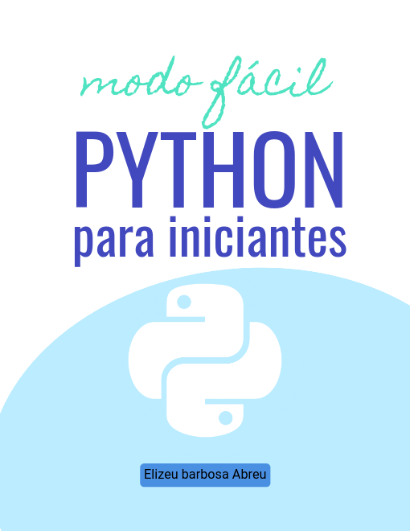
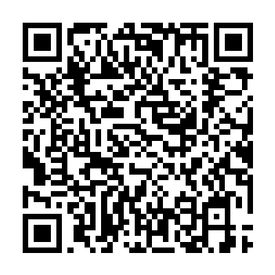

# Python para Iniciante (modo fácil)

## Sobre o livro e o autor

É com grande alegria que vos apresento esse manual que criei para python. Aqui são abordadas as principais características desta linguagem fantástica de programação, instalação, tipos de dados, estruturas de controle de fluxo, listas, tuplas, dicionários e conjuntos, funções e módulos, programação orientada a objetos e muito mais.
Todo o material é gratuito, criei uma versão em PDF e também algumas versões para serem lidas os principais e-readers da atualidade.

## Acesso aos arquivos:

- Versão online: [Leia o livro aqui](Python%20para%20Iniciantes%20(modo%20f%C3%A1cil).md)
- Versões ebook(pdf, mobi, epub, azw3, txtz): [Baixe aqui](ebooks/)

## Dica:

Se você usa o kindle ou outro leitor, sugiro usar o [Calibre - ebook management](https://sofagospel.blogspot.com/2022/12/se-voce-gosta-de-uma-boa-leitura-e-ja.html). 
Com este software dá para ler os ebooks diretamente em seu computador, celular, etc, independente de sistemas operacionais e ainda converter e enviar qualquer ebook via cabo ou e-mail para seu leitor de ebook preferido.

## Faça sua doação:

Ajude-nos a produzir conteúdo gratuito! Se puder envie-me um pix para um cafezinho:

